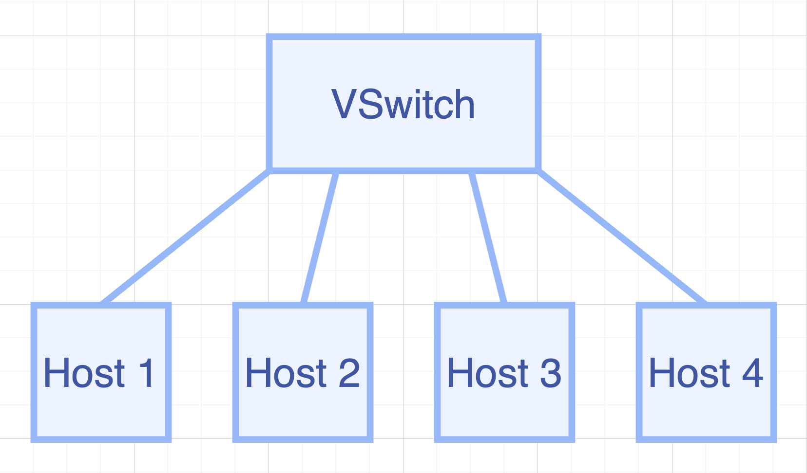
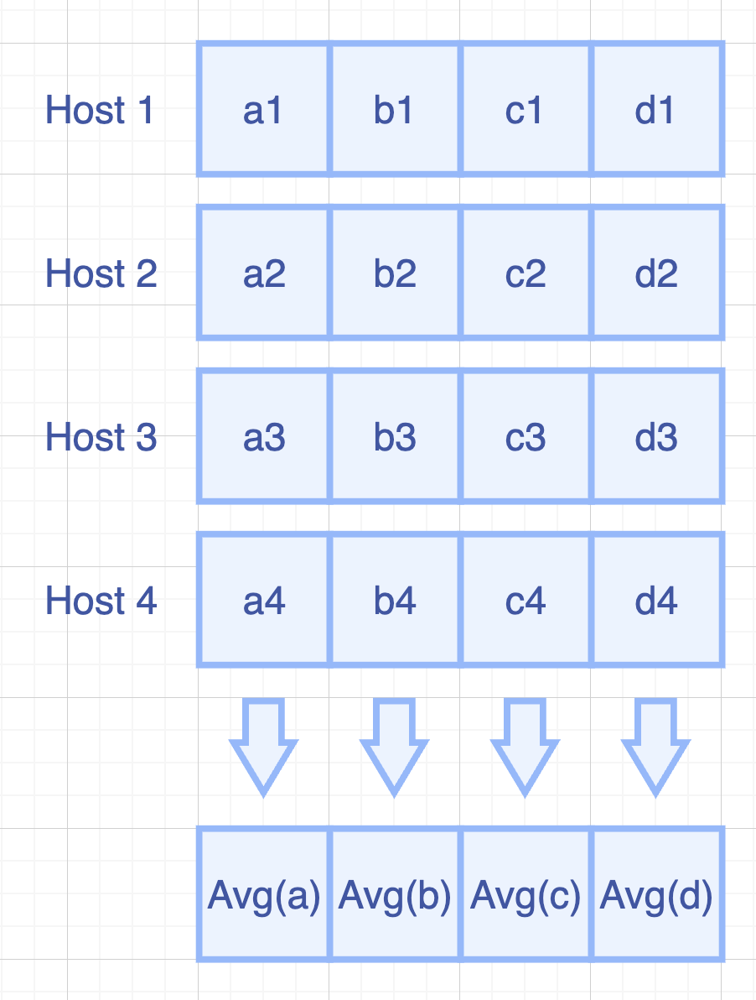
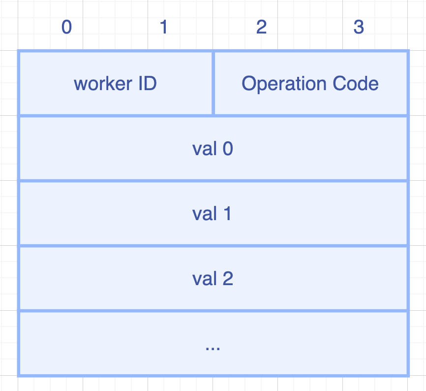

# B: SwitchML

(We assume you have read and understood the basics of the paper "SwitchML" in NSDI 2021 
(https://www.usenix.org/conference/nsdi21/presentation/sapio) )

## Introduction
The objective of this project is to implement a very simple prototype of SwitchML.

The topology used in this assignment is like this (defined in `topo/topology.json`):


We have four distributed machine learning workers running a data parallel training. And they are connected through a switch.

Assume after one iteration, each worker has finished calculating the gradient, they need to synchronize gradients with each other. 

Traditionally, there will be a "parameter server" who will receive all the gradients, calculate the average, and send back to each worker.

In switchml, the programmable switch replaces the parameter server, it will gather each worker's gradients, calculate the average and multicast to the workers. 

(But consider the programmable switch cannot do division, actually we are sending SUM back to the servers and ask the servers to calculate average by themselves. In this assignment, we also just do the SUM, not average.)

An example of the gradient average calculation is like this:


We will define a customized packet format for data transfer. The packet format looks like this:


There are: a 16-bit workerID and a 16-bit OpCode, following `8` 32-bit values, each value represents an element in the gradient.

The switchML packet will be wrapped with Ethernet, IP, UDP packet header. And the IP should be this switch (`10.0.0.254`), the port should be the switchML program (`0x3824` on both sender & receiver). 

For the sake of simplicity, we assume the gradients will contain exactly 8 numbers. Each number is 32-bit int. 

When receive a `DROPOFF` packet, we need to check that: 
- In this iteration, is the data from this host is already received. 
  - If we haven't received it, then record the data and send a `RECORDED` status back. 
  - If already received before, we still send a `RECORDED` status back but won't record the data again, to prevent error from duplicated recording.

When we notice all the workers has dropped off their gradients, we send (multicast) the result back to all of them, with status `RESULT`.

There could be errors in the packets. For example, the packet may have invalid operation code. 

If the error is in the switchML data packet, we send back the packet with `FAILURE` status code.

If a packet is heading to an IP which is not this switch, we should do a normal forwarding. 

If the IP is switch's, but UDP header is with wrong port number, we just simply drop the packet. 

If the IP and port are both correct (This switch's switchML program), but it's wrapped in a TCP header, we also just drop it. 

Note: In distributed machine learning, the gradients are mostly large (MB to GB level). But programmable switches don't have such big memory. SwitchML uses some techniques to aggregate gradients batch by batch. For simplicity, this assignment doesn't require you to implement such a complex system. We only assume 8 numbers in the packet and assume no packet loss.

## Step 1: Run the (incomplete) starter code

The directory with this README also contains a skeleton P4 program, `switchml.p4`, which can only forward packet between the hosts. 
Your job will be to extend this skeleton program to support the switchml facility.

Before that, let's compile the incomplete `switchml.p4` and bring
up a switch in Mininet to test its behavior.

1. In your shell, run:
   ```bash
   make run
   ```
   This will:
   * compile `switchml.p4`, and
   * start the pod-topo in Mininet, and
   * configure all hosts with the commands listed in
   [topo/topology.json](./topo/topology.json)

2. We have implemented two Python-based programs that allows us to send and listen to the gradient data packets from the switch. Run the programs:

   ```bash
   mininet> h1 python3 ./data_dropoff.py 1 2 3 4 5 6 7 8    # to dropoff gradients, you can use any number
   ... (output omitted)
   Timeout! No message received.
   mininet> h1 ./send_data.sh    # a script to run the command above, then you don't need to input the numbers again
   ... (output omitted)
   Timeout! No message received.

   mininet> xterm h1 # open a xterm session for any host
   
   # python3 ./data_listen.py # listen to the packets received at h1, all the SWITCHML packets will be printed.
   ```

3. No message shall be returned by the switch, because our function is not implemented yet. 
Type `exit` to leave each xterm and the Mininet command line.
   Then, to stop mininet:
   ```bash
   make stop
   ```
   And to delete all pcaps, build files, and logs:
   ```bash
   make clean
   ```

Your job is to extend this file to implement data plane of the SwitchML system.

## Step 2: Implementing SwitchML
The `switchml.p4` file contains a skeleton P4 program with key pieces of
logic replaced by `TODO` comments. 

Your implementation should follow the structure given in this file---replace each `TODO` with logic implementing the missing piece.

```
Hint 1:
    After part A, you should be able to understand how the data plane programming language works. It provides us quite good flexibility for packet processing. And the stateful data plane makes many cool ideas possible.

    However, there are some limitations we have to face.
    For example, there's no loop in P4. And there's even NO DIVISION in P4.
    Also, you need to consider that there's only very small memory on data plane. 
    When designing your system, you need to consider these limitations. And you can see the SwitchML's paper used many techniques to "dance with hands tied".
```

In our project, the packets for SwitchML is wrapped with `UDP` with src&dst port `0x3824`. 
The dst ipv4 address of these packets is `10.0.0.254`. 

## Step 3: Run your solution

1. Follow the instructions from Step 1. This time, you should be able to sucessfully dropoff data packets and receive result packet when all the gradients are there. 

2. In addition, you should also make sure that if there is exceptions happening, there should be proper Error message. (The details is in the p4 code)

### Troubleshooting
There are several problems that might manifest as you develop your program:

1. `switchml.p4` might fail to compile. In this case, `make run` will
report the error emitted from the compiler and halt.

2. `switchml.p4` might compile but fail to support the control plane rules in
the `s1-runtime.json` file that `make run` tries to install using P4Runtime. In
this case, `make run` will report errors if control plane rules cannot be
installed. Use these error messages to fix your `switchml.p4` implementation.

3. `switchml.p4` might compile, and the control plane rules might be installed,
but the switch might not process packets in the desired way. The `logs/sX.log`
files contain detailed logs that describing how each switch processes each
packet. The output is detailed and can help pinpoint logic errors in your
implementation.

#### Cleaning up Mininet
In the latter two cases above, `make run` may leave a Mininet instance
running in the background. Use the following command to clean up
these instances:

```bash
make stop
make clean
```

## Running the Packet Test Framework (PTF)
We will be grading your using the Packet Test Framework (PTF), which allows us to specify test cases with different input/output packets to verify your P4 data plane program behavior.
This is inline with modern software engineering practices.

We have provided some public test cases that you can use to quickly test your program.
For that, simply do `./runptf.sh`.

Note that passing all the public test cases do not necessarily mean that you will get full marks for the exercise as there are other hidden test cases that will be used during grading.
In addition, not all public test cases will be scored as some are purely for sanity check.

## Relevant Documentation

The documentation for P4_16 and P4Runtime is available [here](https://p4.org/specs/).

All excercises in this repository use the `v1model` architecture, the documentation for which is available at:
1. The BMv2 Simple Switch target document accessible [here](https://github.com/p4lang/behavioral-model/blob/master/docs/simple_switch.md) talks mainly about the `v1model` architecture.
2. The include file `v1model.p4` has extensive comments and can be accessed [here](https://github.com/p4lang/p4c/blob/master/p4include/v1model.p4).